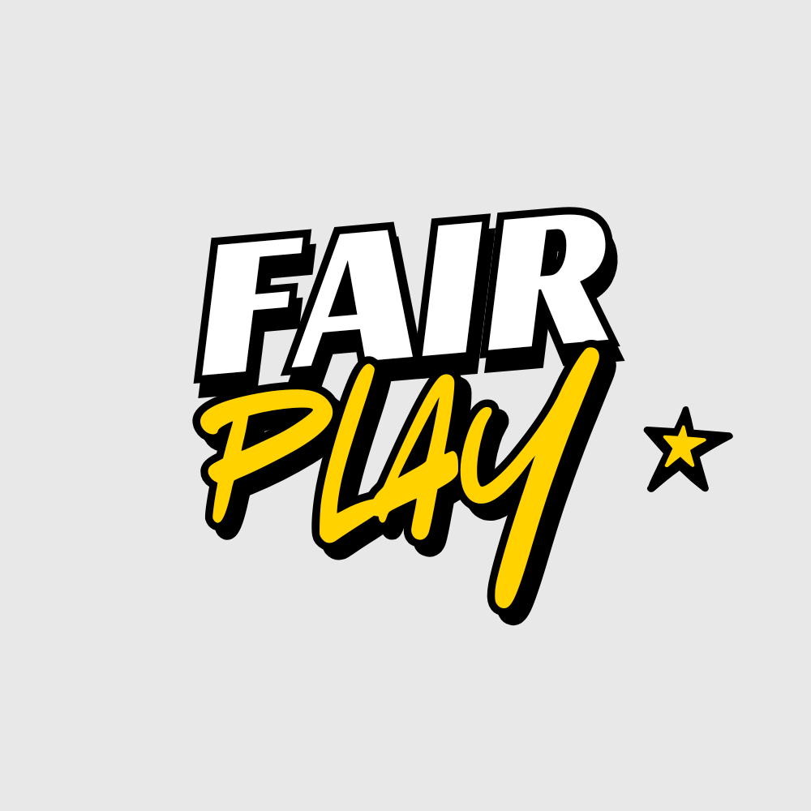

  

# Intended Features

1) User creates a group and is given a unique 6-digit identifier (like a room code)
2) User can log in w/ room code
3) User inputs names and emails
4) Use [Google Form API](https://developers.google.com/workspace/forms/api/reference/rest) to create ranking form
5) Automatically sent out to all players
6) After 48 hours, the data is analyzed:
    - Skill charts for each player
    - PCA analysis to group players
    - Generate teams with K-means + internal cluster ranking by total skill point sum
7) Raw data + analysis is sent out via email

MVP Plan (5/17):
- keep it all on the webpage. no google form
- single person (organizer) ranks everyone
- outputs optimal teams